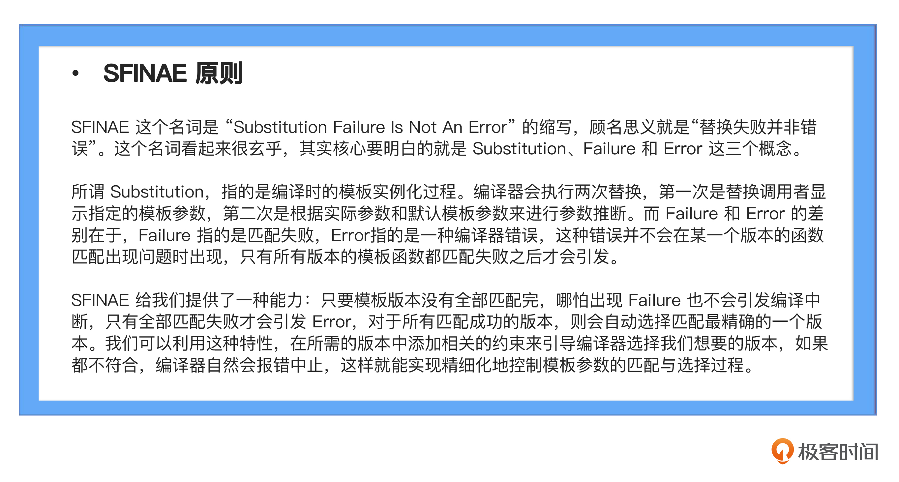
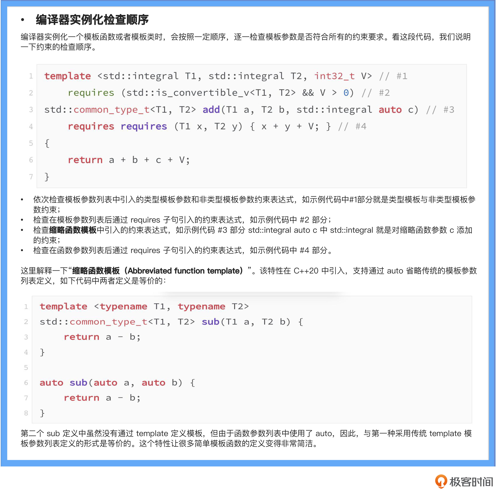

* c++的泛型编程: 模板

* C++匹配模板过程采用SFINAE规则

  * 

* 缺点:

  * 缺乏语言内置支持的模板参数约束能力
  * 报错信息难以理解，难以寻找错误根源。
  * 容易造成代码生成急剧膨胀。
  * ABI 兼容性导致难以在接口中使用模板类型。

* Concepts 解决1,4两个问题

* 如果从语言设计的角度进一步探讨，**Concepts，本质就是让开发者能够定义在模板参数列表中直接使用的“类型”，与我们在函数的参数列表上使用的由 class 定义的类型，理论上讲，是一样的。**所以，在面向对象的编程思想中，我们思考的如何设计清晰且可复用的 class，那从此以后，在泛型编程中我们就需要转变一下，思考如何设计清晰且可复用的 concept。可以说，从 C++20 标准及其演进标准之后，concept 之于 C++ 泛型编程，正如 class 之于 C++ 面向对象。

* Concepts用来定义具有约束的class

* 如果有多个函数, 类型版本，编译期会选择更精准的版本，比如如果有泛型和非泛型版本编译期选择非泛型版本，如果有泛型版本，如果另一个泛型版本更精准则选择更精准的版本，这里的更精准其实是指更多的约束条件，缩小范围的那个版本：

  * ```
    
    // 定义concept 约束: T必须是BaseClass的子类
    template<typename T>
    concept DerivedBaseClass = std::is_base_of_v<BaseClass, T>;
    
    // 定义concept 约束 比DerivedBaseClass 更精准的表达式, 如果有多个版本编译期会选择更精确的版本
    template<typename T>
    concept DDerivedBaseClass = DerivedBaseClass<T> && requires (T h1) {
        h1.GetValue2();
    };
    
    template<typename T>
    // T必须满足DerivedBaseClass约束
    requires DerivedBaseClass<T>
    void DoGetValue(const T &v)
    {
        std::cout << "value:" << v.GetValue() << std::endl;
    }
    
    template<typename T>
    requires DDerivedBaseClass<T>
    void DoGetValue(const T &v)
    {
        std::cout << "value:" << v.GetValue() << std::endl;
    }
    
    // 如果类型都满足DDerivedBaseClass，和DerivedBaseClass，则会选择更精准的DDerivedBaseClass约束的版本
    
    ```

    

* Concepts 约束遵循偏序规则，由上到小template, template之后的约束，函数参数约束，函数参数后的约束

* 