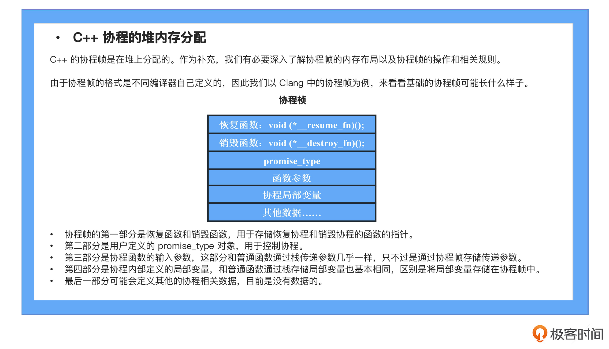

* 目标: 解决异步io复杂度
* 本质: 是一种泛化的函数, 不仅提供函数调用和返回，还提供休眠和恢复机制
  * 创建协程帧
  * 调用协程，执行协程代码
  * co_await/co_yeild 协程休眠
  * 返回原本代码点执行剩余代码
  * 通过句柄coroutine_handle恢复协程
  * 继续向下执行直到协程执行结束，结束后返回到上次挂起点继续执行代码
  * 销毁协程帧
* 协程两大概念：Promise/Awaitable
* Promise: 其实是描述一个未知值的闭包，闭包在c++中以对象形式体现
* 协程栈帧结构
  * 
  * 重点：恢复函数/销毁函数, promise对象，函数参数，协程局部变量
* TODO:
  * 需要处理异常