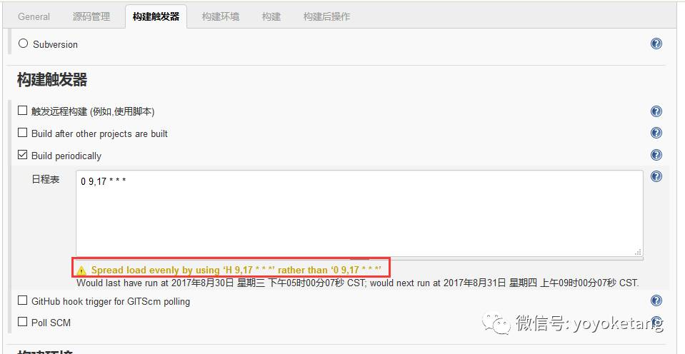

前言

跑自动化用例每次用手工点击jenkins出发自动化用例太麻烦了，我们希望能每天固定时间跑，这样就不用管了，坐等收测试报告结果就行。

 

一、定时构建语法

\* * * * *

(五颗星，中间用空格隔开）

第一颗*表示分钟，取值0~59
第二颗*表示小时，取值0~23
第三颗*表示一个月的第几天，取值1~31
第四颗*表示第几月，取值1~12
第五颗*表示一周中的第几天，取值0~7，其中0和7代表的都是周日

1.每30分钟构建一次：

H/30 * * * *

2.每2个小时构建一次``

H H/2 * * *

3.每天早上8点构建一次

0 8 * * *

4.每天的8点，12点，22点，一天构建3次

0 8,12,22 * * *

（多个时间点，中间用逗号隔开）

5.问题来了：每个月的1-7号一天构建一次咋写呢？

请在屏幕下方写出你的答案，写对有奖励！

 

二、Build periodically

1.Build periodically：周期性进行项目构建，这个是到指定的时间必须触发构建任务

2.比如我想在每天的9点，17点，朝九晚五各构建一次，在Build periodically里设置如下

3.上面红色字体：Spread load evenly by using ‘H 9,17 * * *’ rather than ‘0 9,17 * * *’，这句话大概意思就是说，用这个语法会比后后面那个好：H 9,17 * * *

4.下一次构建时间是05时48分06秒，然后再下次是09时48分06秒

 

二、Poll SCM

1.Poll SCM:定时检查源码变更（根据SCM软件的版本号），如果有更新就checkout最新code下来，然后执行构建动作

2.如果我想每隔30分钟检查一次源码变化，有变化就执行

 

三、Job关联

1.举个案例场景，比如我下面Job1是web项目打包并发布的构建任务，我想每次打完包发布后，然后触发自动化测试Job2的构建。

（当然发布后，一般会等几分钟才会完全加载完成，再下一次构建的时候，可以用python加个脚本sleep几分钟）