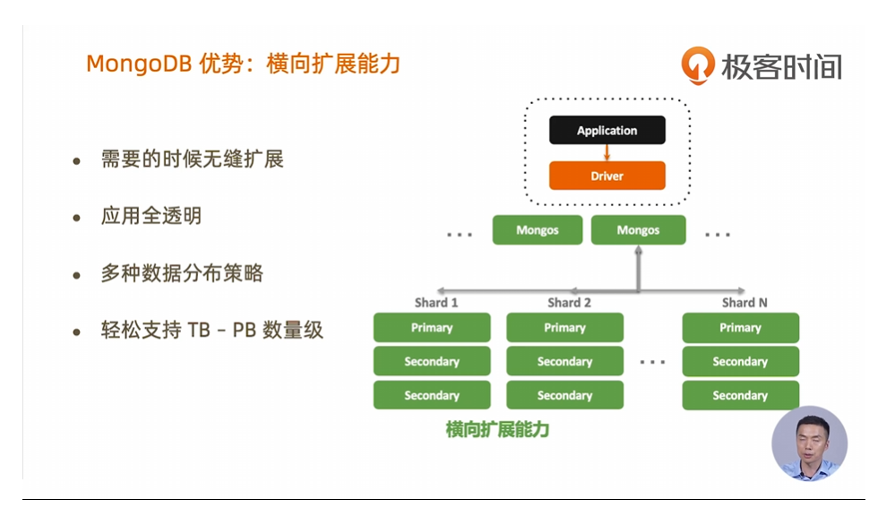
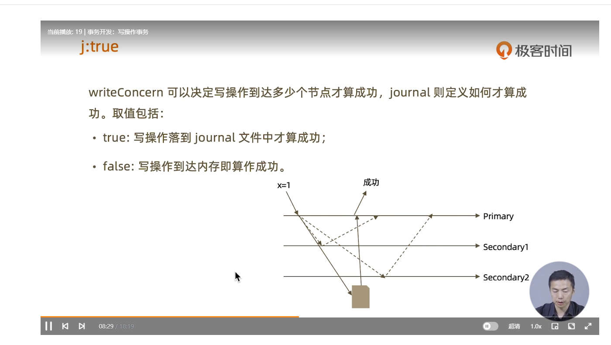
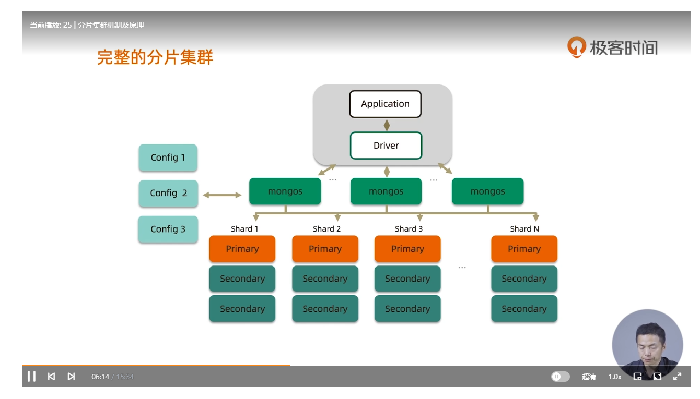

# 概述

面相文档的数据库(document-oriented)，便于扩展，文档模型取代行的概念

没有预定义模式：文档键值的类型和大小不是固定的，由于没有固定模式，因此按需添加或删除字段变得更容易。通常来说开发人员可以进行快速迭代，开发效率更高。

特点：易于使用（没有预定义模式，文档键值类型大小不固定，可以按需添加或删除字段），易于扩展（扩展包括纵向扩展（提高配置），横向扩展（将数据分布到更多机器上），纵向扩展缺点：大型机器比较昂贵，最后仍然会有天花板，横向扩展：便宜且容量可以无限，但是管理大量机器比管理1台机器困难得多，mongo采用横向扩展，面向文档数据模型使得跨堕胎服务器拆分数据更容易，mongo会自动平衡跨集群的数据和负载，自动重新分配文档，并将读写操作路由到正确的机器上）


mongodb 支持通用的二级索引，性能卓越，在其wiredtiger存储引擎中使用了机会锁，最大限度的提高并发和吞吐量，使用尽可能多的ram作为缓存

# 使用注意

* 数据库名称不可大于64字节
* 命名空间(数据库名.集合名)不可大于100字节
* mongodb支持事务，但是由于是分布式数据库，所以不建议使用事务，因为事务就意味着锁，意味着开销


# 基本概念

* **文档**是mongodb中登记表数据单元，每个文档都有一个特殊的键:_id, 其在所属集合中是唯一的
  * 文档中的键是字符串类型（不能含有\0空字符，.$是特殊字符，只能在某些情况下使用属于保留字符，使用不当会造成驱动程序无法正常工作）
  * 文档中的键区分大小写，不能包含重复的键
* **集合**(collection)可以被看作具有动态模式的表
  * 一组文档，文档如果比作关系数据库中的行，那么一个集合相当于一张表
  * 动态模式：集合具有动态模式，意味着一个集合中的文档可以具有任意数量的不同形状(键值对的不同)
  * 对于动态模式的文档管理：开发人员需要确保每个查询只返回特定模式的文档，所以每个集合的每个文档需要确保是同一个对象(允许同一个对象的不同时期的模式不同)
  * 集合名称不能是空字符串，不能含有\0空字符，集合名称不能以system.开拓，该前缀是内部集合保留的，不应包含保留字符$
  * 子集合：使用.字符分隔不同命名空间的子集合例如sys.port
  * 
* 一个mongodb可以拥有多个独立的**数据库**，database, 每个数据库拥有自己的集合
  * 使用数据库对集合进行性分组，一个mongodb可以有多个数据库
  * 数据库名称不能是空字符串，数据库名称不能包含 /、\、.、"、*、<、>、:、|、?、$、单一的空格以及\0空字符，基本上只能使用ascii字母和数字
  * 数据库名称区分大小写
  * 数据库长度限制为64字节
  * 有一些数据库名称是保留的：admin(身份验证和授权时被使用)， local(在副本集中用于存储复制过程中所使用的数据，而local本身不会被复制)，config(mongodb的分片集群会使用config数据库存储关于每个分片的信息)
  * 通过数据库名称与该数据库中的集合名称连接起来可以获得一个完全限定的集合名称，称为**命名空间**，命名空间长度限制为120字节，实际使用应该小于100字节(**也就是说数据库名 + 集合名< 100 字节**)，**需要程序在启动的时候做检查**
* 工具：mongo shell, 管理mongodb实例和使用mongodb的查询语言操作数据，是一个javascript解释器， 用户可以根据需求创建或加载自己的脚本
* 动态模式

# 关于mongo

* json document 
* 用途海量数据处理，数据平台
* 建模，json数据模型，横向扩展，高并发，不要求先建数据模型，比如表结构等
* 社区版（基于SSPL可以自行编译），企业版
* 4.0后支持ACIDS事务
* 3.x引入wiredtiger数据库引擎 性能提升10倍以上
* OLTP(Online Transaction Processing)在线事务处理， OLAP: Offline 


* 多形性：同一个集合中可以包含不同字段类型的文档对象

* 动态性：线上修改数据模式，修改是应用于数据库均无须下线

* 数据治理，支持使用json schema来规范数据模式，保证模式灵活动态的前提下，提供数据治理能力 ，保证一定的有限的数据模式

* 高可用，横向处理能力

  * 
  * 5个9高可用通过复制集实现，最佳实践：最少3个以上，且奇数，以便投票机制有多数票
  * 横向扩展：通过分片集群实现，每个分片一个复制集群
    * 
* 无下线滚动更新

# 安装mongoddb

* windows: mongodb-windows-x86_64-8.0.4-signed.msi, 并安装mongodb compass

* linux

  * 下载mongodb tar (export PATH=$PATH:/root/mongodb/bin)

  * 运行mongod  mongod --dbpath /root/mongodb/db_data --port 27017 --logpath /root/mongodb/db_data/mongod.log --fork

  * 下载mongodb shell 执行 mongosh 默认连接mongodb（export PATH=$PATH:/root/mongosh/bin）

  * 使用mongodump和mongorestore工具来到处mongodb数据和导入mongodb数据

  * 赋予权限：

    ```
    use admin
    db.createUser({ user:"xxxx", pwd:"xxxx", roles:[{role:"userAdminAnyDatabase", db:"admin"}, "readWriteAnyDatabase"]})
    
    ```

  * 

# mongodbCURD

* mongodb没有显示的建库指令，会在首次插入数据的时候自动创建

* 切换数据库

  * use xxx

* collection的查询， 查询如果加上.pretty()则会对结果进行缩进

  * ```
    // 查询orders表全部数据
    db.orders.find()
    // 查询userId为500的数据
    db.orders.find({userId: 500})
    // 查询userId大于1000的数据, 子查询必须是key: {$xxx: value}, 这个是美元符运算符用来查询数据
    db.orders.find({userId:{$gt: 1000}})
    
    // exists子查询, 表示userId2不存在则返回数据, 如果true则表示存在的时候返回数据
    db.orders.find({userId2: {$exists: false}})
    
    // in子查询, 查询userId为100,1000的数据
    db.orders.find({userId:{$in: [100, 1000]}})
    
    // nin是不在数组中的数据
    
    // or子查询, 查询a为1或b为2的数据
    db.orders.find({$or:[{a:1}, {b, 2}]})
    // and子查询，匹配全部
    db.orders.find({$and:[{a:1}, [b,2]]})
    // 正则表达式查询, 字母B开头的查询出来
    db.orders.find({name:/^B/})
    ```

  * 

  * 查询匹配某个子文档，应该在key填写子文档的路径xxx.xxx.xxx...

    * ```
      // 查询子文档user下hp为1000的数据
      db.orders.find({"user.hp":1000})
      ```

  * 查询匹配子文档是一个数组的情况, 数组中元素是一个对象的情况：

    ```
    // 查询orderLines是一个数组, 数组中的元素是object, 则查询包含product:"Ergonomic Metal Salad", 的数据
    db.orders.find({ "orderLines.product": "Ergonomic Metal Salad" })
    
    ```

  * 匹配子文档为数组，且满足多个条件：使用$elemMatch

    * ```
      // 查询数组orderLines中存在product:"Ergonomic Metal Salad", qty:28的文档数据
      db.getCollection("orders").find({"orderLines":{$elemMatch:{"product":"Ergonomic Metal Salad", qty:28}}})
      
      ```

  * 不一定要把所有的字段都发返回，可以使用mongodb的投影(projection)来控制返回，

    * ```
      // 查找所有数据，返回时不返回_id,(find的第二个对象是控制返回)
      db.fruit.find({},{_id:0})
      ```

      

* collections删除，使用db.fruit.remove({xxxx...})

  * 删除符合条件的数据

    * ```
      // 删除sex为1的数据
      db.fruit.remove({sex:1})
      // 删除sex > 1的数据
      db.fruit.remove({sex:{$gt:1}})
      ```

      

* collections的更新

  * 使用updateOne/updateMany, updateOne在查找到匹配的数据时只更新第一条数据，且需要指定$set:{xxx:xxx}, $unset:{}, 来增删或者更新字段

    * ```
      db.orders.updateOne({userId:3282, country:"Italy" }, {$set:{baby:123}})
      
      // 找到匹配userId:3282, country:"Italy"的数据并且更新所有数据的baby字段为1523
      db.orders.updateMany({userId:3282, country:"Italy" }, {$set:{baby:1523}})
      
      ```

  * 其他的指令: 

    * $push: 增加一个对象到数组底部

    * $pushAll: 增加多个对象到数组底部

    * $pop: 从数组底部删除一个对象

    * $pull: 如果匹配指定的值，从数组中删除相应的对象

    * $pullAll: 如果匹配任意的值, 从数据中删除相应的对象

    * $addToSet: 如果不存在则增加一个值到数组

    * $unset: 将符合条件的数据的某个字段不设置成xxxvalue, 也就是如果值为xxxvalue时会被移除：

      * ```
        // 当baby字段为1523时移除字段baby
        db.orders.updateMany({userId:3282, country:"Italy" }, {$unset:{baby:1523}})
        
        ```

        

* collections的插入

  * insertOne(json)/insertMany(json1, json2)

    * ```
      // 向fruit表插入一条数据，如果fruit不存在则会创建
      db.fruit.insertOne({name:"eric", sex:1})
      // 插入多条数据
      db.fruit.insertMany([{name:"eric", sex:1}, {name:"peet", sex:2}])
      ```

      

* 删除集合drop

  * db.fruit.drop()

* 删除数据库

  * db.dropDatabase()


# MongoDb复制集

* 意义：实现服务高可用（希望24*7， 5个9的在运行）

* 实现：数据写入时将数据迅速复制到另一个独立节点上，在接受写入的节点发生故障时自动选举出一个新的替代节点

* 复制集实现了其他几个附加作用
  * 数据分发：将数据从一个区域复制到另一个区域，减少另一个区域的读延迟(美洲写入，其他地区可以读)
  * 读写分离：不同类型的压力分别在不同的节点上执行
  * 异地容灾：在数据中心故障时快速切换到异地
  
* 典型复制集结构（奇数节点，不希望出现僵局）
  * 常见至少3节点
  * 3个以上具有投票权的节点组成，包括：一个主节点（接受写入操作，读操作和选举时投票），两个或多个从节点（复制节点上的新数据，接受读操作和选举时投票）
  
* 数据复制
  * 当一个增删改操作到达主节点时它对数据的操作将被记录下来(oplog, 经过一些必要的转换)，从节点一个线程监控oplog的变动，通过在**主节点上打开的一个tailable游标不断获取新进入主节点的oplog，并在自己的数据上回放**，以此保持和主节点的数据一致
  * 
  
* 通过选举完成故障恢复
  * 具有投票权(通过配置配置节点的投票权)的节点之间亮亮互相发送心跳
  * 当5次心跳未收到时判断为节点失联，**如果失联的是主节点，从节点回发起选举，选出新的主节点**，如果失联的是从节点，则不会产生新的选举
  * 选举基于**RAFT一致性算法**实现，**选举成功的必要条件是大多数投票节点存活**
  * 复制集中最多可以有50个节点，**但具有投票权的节点最多7个**
  
* 影响选举因素
  * 整个集群必须有大多数节点存活
  * 被选举为主节点的节点必须：
    * 能够与多数节点建立连接
    * 具有较新的oplog
    * 具有较高的优先级(如果有配置)
  
* 复制集选项
  * 是否具有投票权(v参数)：有则参与投票
  * 优先级(priority参数): 有玄机越高的节点越优选成为主节点，优先级为0的节点无法成为主节点
  * 隐藏(hidden参数)：复制数据, 但对应用不可见。隐藏节点可以具有投票权
  * 延迟(slaveDelay参数)：复制n秒之前的数据，保持与主节点的时间差（设置延迟n秒之后被同步, 这样当某个操作误删数据，这个延迟节点不会被同步到，这样降低损失）
  
* 复制集注意事项
  * 关于硬件：应该用正常一样的配置给所有的节点，同一个区不同机器上
  * 关于软件：所有节点尽量版本一致
  * 增加节点不会增加系统写性能，但是可以扩展你的读(一般只从主节点写入操作, 从节点只对外提供读操作)
  
* 搭建mongodb复制集

  * 创建db数据文件目录

    * ```
      // windows:
      md c:\data\db1
      md c:\data\db2
      md c:\data\db3
      
      // linux:
      mkdir -p /data/db{1,2,3}
      ```

  * 创建各自的配置文件(每个都独立的配置,注意yaml中的路径得是绝对路径)

    * ```
      systemLog:
          destination: file
          path: /root/mongodb/db1/mongod.log
          logAppend: true
      storage:
          dbPath: /root/mongodb/db1
      net:
          bindIp: 0.0.0.0    # 监听所有网卡
          port: 28017
      replication:
          replSetName: rs0    # 复制集名
      processManagement:
          fork: true # 作为后台进程运行
      ```

  * 启动mongod多个实例

    * ```
      mongod -f ~/mongodb/db1/mongod.conf
      mongod -f ~/mongodb/db2/mongod.conf
      mongod -f ~/mongodb/db3/mongod.conf
      ```

  * 进入mongo命令行

    * ```
      // 一般使用第一个端口作为主节点
      mongosh 127.0.0.1:28017
      
      // 命令行中执行
      rs.initiate()
      
      // 执行后会变成SECONDARY, 再按回车切换到PRIMARY
      
      // 返回复制集的状态信息rs:repliset(复制集的意思)
      rs.status()
      
      // 如果是在一台机器上, 需要测试hostname 是否正确:
      hostname -f
      // 添加从节点：
      rs.add("xxx:port")
      
      
      // 允许从节点读数据：
      rs.slaveOk()
      
      // 一个复制集中只能由一个PRIMARY， 多个SECONDARY
      
      
      ```

* Mongo全家桶工具介绍

  * 

  * ```
    mongod: 数据库软件
    mongosh: Mongodb 命令行工具，管理mongodb数据库
    mongos: mongodb路由进程，分片集群下使用
    mongodump/mongorestore: 备份和恢复
    
    // 备份
    mongodump -h 127.0.0.1:27017 -d test -c test
    -d: 指定database
    -c: 指定集合
    mongorestore -h 127.0.0.1:27017 --drop --dir=dump -d test -c test xxx.bson
    --dir: 指定备份文件目录
    --drop: 碰到已存在的collection会先drop再覆盖集合
    
    // 全量覆盖: 先drop数据库, 再执行恢复, mongosh登录到数据库, 并使用--eval执行drop
    mongosh 127.0.0.1:28017/test2 --eval "db.dropDatabase()" && \
    mongorestore -h 127.0.0.1:28017 --dir=dump --nsInclude=test2.*
    
    
    
    ```

* 备份和恢复

  * ```
    // 备份
    mongodump -h 127.0.0.1:27017 -d test -c test
    -d: 指定database
    -c: 指定集合
    
    // 恢复
    mongorestore -h 127.0.0.1:27017 --drop --dir=dump -d test -c test xxx.bson
    --dir: 指定备份文件目录， 默认是当前路径下的dump目录
    --drop: 碰到已存在的collection会先drop再覆盖集合
    
    // 全量覆盖: 先drop数据库, 再执行恢复, mongosh登录到数据库, 并使用--eval执行drop
    mongosh 127.0.0.1:28017/test2 --eval "db.dropDatabase()" && \
    mongorestore -h 127.0.0.1:28017 --dir=dump --nsInclude=test2.*
    ```

* 关闭mongo实例（需要先关闭所有从节点，再关闭主节点）

  * ```
    mongod -f /root/mongodb/db3/mongod.conf --shutdown
    
    ```

    

* 自动化脚本

  * 可以使用mongosh 127.0.0.1:28017/xxxdatabase --eval "xxxxScript"

  * --eval 后面可以执行mongosh命令, 达到在脚本中操作mongo数据库

  * xxxdatabase是使用mongosh要登陆的目标数据库名

  * 注意需要权限的话：

    * ```
      mongosh 127.0.0.1:28017/test2 -u 用户名 -p 密码 --authenticationDatabase admin --eval "db.fruit.insertOne({name:'xxx', sex:3})"
      ```

    * --authenticationDatabase: 认证数据库（通常为 `admin`）

* 设置mongodb密码验证

  * ```
    # 启用认证
    security:
      authorization: enabled  # 关键设置
      
    // 创建管理员用户
    use admin
    db.createUser({
      user: "admin",
      pwd: "yourStrongPassword",
      roles: [ 
        { role: "userAdminAnyDatabase", db: "admin" },  // 用户管理权限
        { role: "readWriteAnyDatabase", db: "admin" },   // 数据读写权限
        { role: "clusterAdmin", db: "admin" }            // 数据库管理权限
      ]
    })
    
    重启mongodb
    1. 先mongosh 登录到从节点, 再通过use admin
    db.shutdownServer() 来关闭所有从节点, 最后关闭主节点
    
    2. 使用
    mongod -f ~/mongodb/db1/mongod.conf
    mongod -f ~/mongodb/db2/mongod.conf
    mongod -f ~/mongodb/db3/mongod.conf
    
    然后再在主节点上操作添加两个节点
    # 启用认证
    security:
        authorization: enabled
        
    // 启用认证需要添加keyFile:
    openssl rand -base64 756 > /root/mongodb/keyfile
    将keyFile复制到每个实例配置同级目录
    并在security:
        keyFile:/root/mongodb/db1/keyFile
    keyfile 必须修改权限, 否则启动不了实例：
    chmod 600 /root/mongodb/db1/keyfile
    
    // 权限不足追加权限
    db.grantRolesToUser("admin", [{ role: "clusterAdmin", db: "admin" }])
    ```

* 关闭复制集

  * ```
    需要先mongosh到从节点, 使用db.shutdownServer()关闭所有从节点, 最后关闭主节点
    ```

* mongocompass

  * 配置完mongodb认证后, 则可以在Advanced ConnectionOptions填写Authentication,用户名密码，并在General中勾选Directly Connection

# 模型

* 关系型数据库与文档型数据库的区别
  * 

* 套用模式设计
  * 分桶模式
    * 
  * 列转行并建立索引
    * 
  * 版本字段管理文档模型版本
    * 
  * 近似计算(延迟写入, 对于不重要的写操作来说)
    * 
  * 对于重要的场景不能用近似计算，要用预聚合字段
    * 

# 事务

* writeConcern：决定一个写操作落到多少个节点才算成功

  * 
  * 要设置绝大多数节点写入完成才能算成功, 避免丢数据
  * 要设置journal 等写完日志才算成功, 避免丢数据
    * 
    * 如何验证journal有没开启, 则看你的数据库目录下的journal目录下有没有存在WiredTigerLog.*文件，有表示Journal已启用
    * 一般WiredTiger存储引擎是默认启用Journal

* 读操作可以设置从节点读取, nearest读取等

  * 

* readConcern, 类似关系型数据库的隔离性, 类似设置隔离级别

  

  mongodb 通过mvcc机制，维护多个版本来是实现majority数据隔离

  

  需要mongod.conf设置enableMajorityReadConcern: true,会有一定的性能开销

  

  majority，会一直等待：
  

  majority, 可以有效避免脏读：与关系型数据库中的提交读隔离级别相当(常用)
  

  majority对应的隔离级别：
  

线性化读:


快照：最高级别


# 事务

* mongodb 支持事务，但不建议使用

  

* 多文档事务

  * 

# mongo最佳实践

* 连接

  * 如果是复制集必须把所有节点都填上去，避免哪个节点不可用

  * 连接到分片集，需要把mongos的地址都列上去

  * 

  * 常见参数（在连接串上设置）

    * MaxWaitTime:建议设置，自动杀掉太慢的查询
    * WriteConcern: majority，这样所有的写操作都会保证majority
    * ReadConcern: 对数据一致性要求高的场景使用, 所有的读操作都会按照这个要求
    * 

  * 使用域名连接集群(mongodb srv协议)

    * 

  * mongodb不建议使用负载均衡

    

  * 游标使用，记得关闭 默认情况下，游标在闲置 10 分钟后会被服务端自动销毁。（在find的数组结果是一个游标, 必须要主动关闭）

    

  * 查询及索引

    

  * 关于写入(使用update只更新部分数据，尽量使用批量插入, ttl自动过期日志类型数据)

    

  * 关于文档结构(字段名需要短小精悍, 数组不要嵌套太深)

    

  * 避免使用count, 它用不上索引，会导致mongodb变慢

    

  * 巧分页

    

  * 事务（能避免则避免）

    

# 分片集群

* 常见部署架构

  

* 为什么使用分片集群

  

* 完整的分片集群

  * 

* mongos 作用：提供集群单一入口，转发应用段请求, 选择合适数据节点进行读写合并多个数据节点返回，无状态，建议至少两个

* config: 配置节点，按照复制集进行部署, 提供集群元数据存储，分片数据分布的映射, 

* 数据节点：mongod 以复制集为单位横向扩展，最大1024分片，分片间的数据不重复，所有分片在一起才可以完整工作，比如：4个分片，每个分片占25%数据

* 分片集群特点：

  * 应用全透明，无特殊处理：不需要应用层特殊修改，即可从复制集扩展到分片集群
  * 数据自动均衡：自动监测各个分片的数据分布情况，如果不平衡，在后台自动搬迁数据
  * 动态扩容，无需下线：可以从复制集，动态线上加到集群中，实现动态无下线扩容机制
  * 提供三种分片方式：
    * 基于范围: 选一个或几个组合字段，对值进行分开，分成多个chunk, 范围存在对应表里面，来把数据分布到不同chunk，好处是查询性能好一点，但是容易有热点，因为在一段时间内总是读写某个chunk
    * 基于hash：按某个字段求hash，这样写会随机写到不同chunk中，写优化，查询效率低一点
    * 基于zong/tag：给shard打标签，这样如果数据有标签会路由到指定tag的分片上

* 如何用好分片集群：

  * 

* 分片的基本标准

  * 数据：数据量不要超过3TB, 尽可能保持在2TB一个分片
  * 索引：常用索引必须容纳进内存
  * 按照以上标准初步确定分片后，还需要考虑业务压力，随着压力增大, CPU,RAM,磁盘中的任何一项出现瓶颈时，都可以通过添加更多分片来解决

* 需要多少个分片：

  * 
  * 工作集：热数据 + 索引所占的内存，热数据一定会加载到内存，256GB是物理内存，一般一个shading所占内存是 256 *0.6， 所以如果工作集总大小是400G那么需要3个sharding
  * 并发量
  * 分片分布：是否需要跨机房分布分片，是否需要容灾，高可用的要求如何
  * 

* 概念

  * 片键 shard key:文档中的一个字段或多个字段
  * 文档doc：包含shardkey 的一行数据
  * 块 chunk：包含n个文档，逻辑概念，通常块一般64MB, 在集群间做数据均衡的时候一般以块为单位
  * 分片：shard: 包含n个chunk，至少3个节点的复制集
  * 集群cluster：包含n个分片
  * 

* 影响片键效率的主要因素：

  * 
  * 选择基数大的基数（值的范围，决定基数大小）：块是根据基数范围来确定，基数太小，那么移动的数据块就很大，会导致数据均衡失败，所以基数要很大
  * 取值分布尽可能均衡：大量数据集中在某些块，就会导致某段时间内某些块访问压力比较大
  * 定向性能好：
    * 
  * 举例子：
    * 片键：_id
      * 
      * 基数够大
      * 写分布不均匀，因为_id是自增，一段时间内会集中在某个shard，会导致热写，写到有个shard，又要均衡，所以会数据搬迁一次，性能不好
      * 定向查询也不好，它是个随机值，查询不方便
    * 片键：_id: hashed, 哈希
      * 基数 ok
      * 写分布，自增id变成了一个随机的id，解决了写分布的问题
      * 定向查询：查询还是要到所有的分片上去找，不好
    * 片键：user_id
      * 基数不够大，会导致数据存储在某几个shard里面，会导致超级块
      * 写分布和定向查询都好
    * 片键：{user_id:1, time:1}, 组合片键
      * 基数够大
      * 写分布好
      * 定向查询也好

* 足够的资源：

  * 

  * 要有额外的资源做监控，监控mongos，mongod，config的qps, 磁盘，cpu等资源，当达到60%及以上的时候要提前扩容

    

* 搭建分片集群与扩容

  * 步骤：
    * 
    * 1. 创建目录：shard1, shard2, config, mongos
      2. 初始化shard1 复制集
      3. 初始化config复制集
      4. 启动mongos将configserver地址 加给mongos
      5. mongos的权限是读取configdb的权限，所以必须先初始化好config和mongod复制集完成后才可以启动mongos集群并使用configDb上的用户权限进行配置
